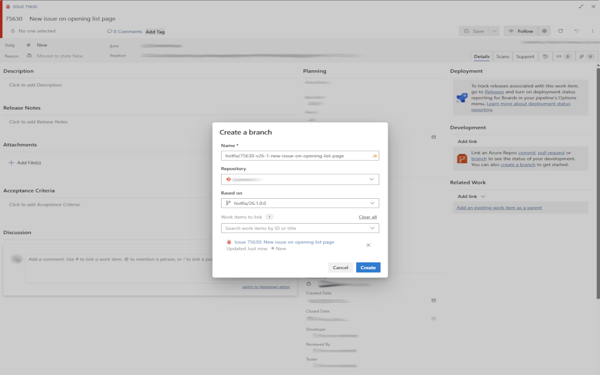
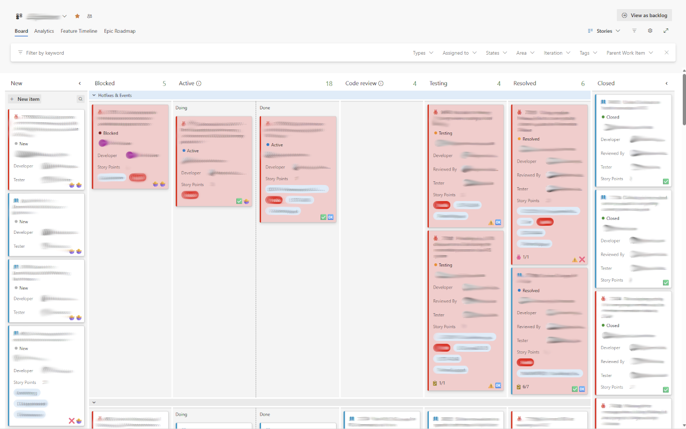

# ADO Helper Extension

**ADO Helper** is a Microsoft Edge extension designed to supercharge your Azure DevOps (ADO) workflow. It streamlines branch creation and provides instant visual feedback on Build and PR statuses directly on your boards.

## 🚀 Features

### 1. Smart Branch Name Generator
Automatically generates standardized branch names based on the work item you are viewing.
- **One-Click Generation**: Click the ✨ icon in the "Create Branch" dialog.
- **Configurable Formats**: Custom prefixes for User Stories, Bugs, and Hotfixes.
- **Clean Formatting**: Automatically sanitizes titles (removes special characters, replaces spaces with hyphens).

### 2. Visual Build & PR Statuses
Get immediate insight into the health of your work items directly from the Kanban board or Backlog view.
- **Build Status**: Shows the status of the latest build linked to the ticket.
- **PR Status**: Shows the status of active Pull Requests.
- **Visual Indicators**:
  - ✅ **Succeeded**: All builds/PRs passed.
  - ⚠️ **Partially Succeeded**: Warnings present (Yellow).
  - ❌ **Failed**: Build or PR failed.
  - 🔄 **In Progress**: Currently running.
  - 🚫 **Canceled**: Operation was canceled.
  - 🤷‍♀️ **Not Found**: Build or PR not found.

### 3. Customizable Settings
Configure the extension to match your team's workflow via the Options page.
- Set custom branch prefixes.
- Toggle specific features on/off.
- Securely manage ADO API credentials.

## 📦 Installation

1. Clone or download this repository to your local machine.
2. Open Microsoft Edge and navigate to `edge://extensions`.
3. Enable **"Developer mode"** using the toggle in the bottom-left or top-right corner.
4. Click **"Load unpacked"**.
5. Select the `ado-helper-browser-extension` folder containing the `manifest.json` file.

## ⚙️ Configuration

To enable the Build and PR status features, you must configure your Azure DevOps details:

1. Click the extension icon in your browser toolbar and select **Options** (or right-click the extension > Extension Options).
2. Enter your **Organization Name** and **Project Name**.
3. Enter a **Personal Access Token (PAT)**.
   - *Note: The PAT requires `Build (Read)`, `Code (Read)`, and `Work Items (Read)` scopes.*
4. Click **Save**.

## 📖 Usage

### Generating a Branch Name
1. Open a Work Item in Azure DevOps.
2. Click the "Create Branch" link.
3. In the dialog, look for the ✨ icon inside the branch name input field.
4. Click it to populate the field with your formatted branch name.

### Viewing Build Statuses
1. Navigate to your ADO **Boards** or **Sprints** view.
2. The extension will automatically fetch and display status icons (✅, ❌, etc.) on the bottom right of the work item cards.
3. Hover over an icon to see a tooltip with more details (e.g., "Some builds failed").

## 🛠️ Development

To make changes to the extension:

1. Edit the files in your local folder (e.g., `src/content.js`, `src/azureDevOpsApi.js`).
2. Go to `edge://extensions` in your browser.
3. Find the **ADO Helper** card.
4. Click the **Reload** button (circular arrow icon).
5. Refresh your Azure DevOps page to see the changes.

## 🔒 Security Note
Your Personal Access Token (PAT) is stored locally in your browser using the `chrome.storage.sync` API. It is never sent to any third-party server; it is only used to communicate directly with the Azure DevOps REST API.

## 📜 Version History

### v1.2.0
- **Fix**: Resolved an issue where the PR status was incorrectly calculated when PR failed first time and new commit is pushed.
- 
### v1.1.0
- **Fix**: Resolved an issue where the PR status was incorrectly calculated when the merge status was "succeeded".

### v1.0.0
- Initial release with Branch Name Generator and Build/PR Status indicators.

## 📄 License
[MIT](LICENSE)
